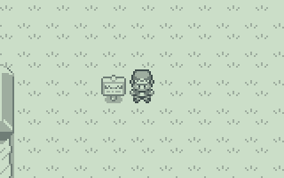
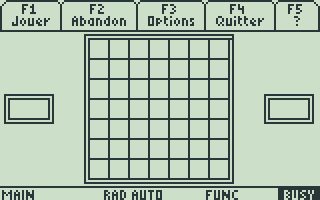
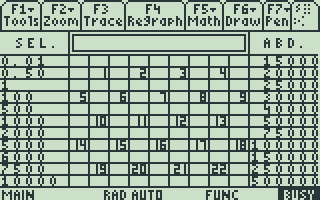
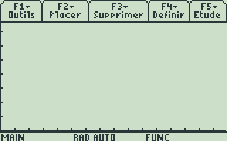
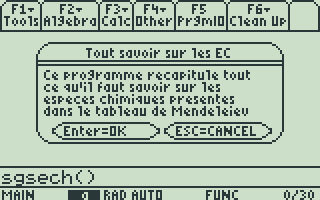

# ti89-archives

Collection of some TI-89 programs in C and TI-BASIC that I made a long time ago.

As of August 2019, these are still buildable using [TIGCC 0.96 Beta 8](http://tigcc.ticalc.org) and runnable on [TI-89 Titanium OS 3.10](https://education.ti.com/en/products/calculators/graphing-calculators/ti-89-titanium).

Note: TI-BASIC binary file contents (*.89p) have been converted into text for easier browsing using [TI-Edit 0.3.1](http://tiedit.free.fr/index.php), even though some characters are not properly converted (for instance, the "store symbol" is not converted into an appropriate UTF-8 representation such as "→").

## Games

### Sacha

| | |
| - | - |
| Description | Pokemon game prototype |
| Release date | 2008-02 |
| Language | C |
| Build requirements | extgraph.a and extgraph.h from [ExtGraph 2013-07-30](https://github.com/debrouxl/ExtGraph) |

### SGSsdk

| | |
| - | - |
| Description | Sudoku solver |
| Release date | 2007-01 |
| Language | C |

### SGScas

| | |
| - | - |
| Description | Square flipping game |
| Release date | 2006-08 |
| Language | TI-BASIC |
| Runtime requirements | Flib.89z from [Flib 3.2](http://leiber.free.fr/?http://leiber.free.fr/ti/flib/index.html) |

### SGSapl

| | |
| - | - |
| Description | Deal or No Deal game |
| Release date | 2006-07 |
| Language | TI-BASIC |
| Runtime requirements | Flib.89z from [Flib 3.2](http://leiber.free.fr/?http://leiber.free.fr/ti/flib/index.html) |

## Applications

### SGSgeo

| | |
| - | - |
| Description | Geometry application |
| Release date | 2006-08 |
| Language | TI-BASIC |
| Runtime requirements | Flib.89z from [Flib 3.2](http://leiber.free.fr/?http://leiber.free.fr/ti/flib/index.html) |

### SGSech

| | |
| - | - |
| Description | Periodic table of elements |
| Release date | 2006-03 |
| Language | TI-BASIC |
| Runtime requirements | Flib.89z from [Flib 3.2](http://leiber.free.fr/?http://leiber.free.fr/ti/flib/index.html) |
